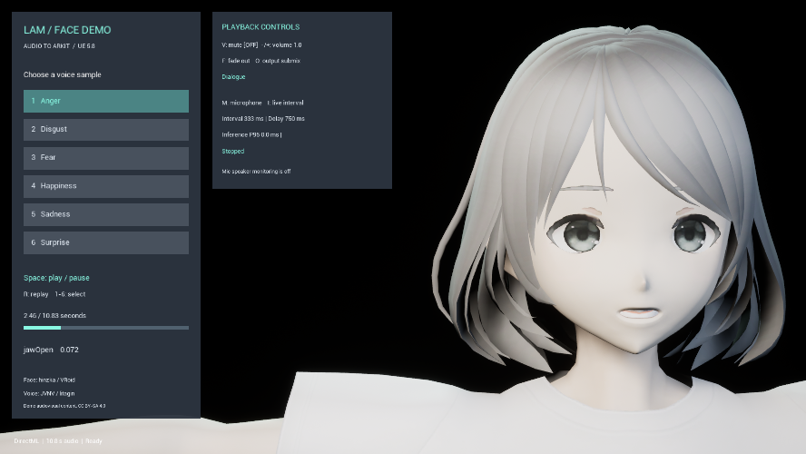

# LAM Audio2Expression UE Demo

Windows x64 用の音声表情プラグインを試すデモです。SoundWave を非同期で解析し、音声再生に同期した ARKit 52 カーブを AnimGraph に適用します。推論は UE NNE の DirectML を優先し、利用できない場合は CPU に切り替えます。

このリポジトリはデモ・検証用UEプロジェクトです。[プラグイン本体](https://github.com/yeczrtu/LAMAudio2Expression-UE) は独立したリポジトリで、`Plugins/LAMAudio2Expression` からサブモジュールとして参照します。顔・音声・操作UIとそのライセンス表記はデモ側で管理します。

## 新規cloneからの準備

GitHubにはニューラルモデルを含めていません。顔デモ用のメッシュ・音声・マップはこのプロジェクトの `Content/LAMFaceDemo` に同梱しています。UE 5.8.2、Visual Studio 2022 C++、Python 3.10、Gitを用意して次を実行してください。

```powershell
git clone --recurse-submodules https://github.com/yeczrtu/LAMAudio2Expression-UE-Demo.git
cd LAMAudio2Expression-UE-Demo
./Tools/setup.ps1 -Engine D:\Unreal\UE_5.8
```

既存cloneでは `git submodule update --init --recursive` でプラグインを取得します。setupはモデルの取得・SHA-256照合・ONNX変換・数値比較・モデルとテスト用アセットの生成を行います。`/Game/LAMDemo` と `/Game/Audio` のテストデータを再生成するため、これらを編集した場合は先にバックアップしてください。顔デモは再生成しません。

旧版の通常フォルダーが残り、サブモジュールの初期化で「空ではない」と表示される場合は、新規cloneへ移行し、生成済みの `Plugins/LAMAudio2Expression/Content/Models` をコピーしてください。

## 起動

`LAMDemo.uproject` を UE 5.8.2 で開き、`/Game/LAMFaceDemo/Maps/LAM_FaceDemo` をPlayします。hinzka / VRoidの顔と、JVNV / litaginの6音声を同梱しています。クリックまたは1～6で音声を選択、Spaceで一時停止／再開、Rで先頭から再生できます。[顔デモの詳細とライセンス](Docs/FACE_DEMO.md)を参照してください。

従来の52値表示・合成音声テストは `/Game/LAMDemo` に残っています。こちらではMキーでマイク入力へ切り替えられます。

## 別プロジェクトへの導入

1. `Plugins/LAMAudio2Expression` をプロジェクトの `Plugins` にコピーします。モデルを含む `Content` もコピーしてください。
2. プラグインを有効にして C++ をビルドし、エディタを再起動します。UE 5.8.2、Visual Studio 2022 C++ ツールチェーンで検証済みです。
3. Project Settings → LAM Audio2Expression の Model を `/LAMAudio2Expression/Models/LAM_A2E` に設定します。
4. パッケージ設定の Additional Asset Directories to Cook に `/LAMAudio2Expression/Models` を追加します。設定の Soft Reference だけにモデルの Cook を依存させないでください。
5. 音声を鳴らす Actor に `LAMAudio2ExpressionComponent` を追加します。

プラグインのコピーには、このデモプロジェクトのキャラクター・音声・CC BY-SA文書は含まれません。プラグインだけを直接取得する方法は [プラグイン本体の導入説明](https://github.com/yeczrtu/LAMAudio2Expression-UE#導入) を参照してください。

初版は通常の mono/stereo SoundWave、8～192 kHz、最大300秒に対応します。解析入力は16 kHzに変換しますが、再生は元の SoundWave を使用します。SoundCue／MetaSound／Procedural SoundWave／外部ファイルは対象外です。

## Blueprint

```text
BeginPlay または任意のイベント
  → Analyze SoundWave Async(Component, SoundWave, Settings)
      Completed(Clip) → Component.Play Expression Clip(Clip, StartTime=0)
      Progress       → ロード表示を更新
      Failed         → Error を表示
      Cancelled      → ロード表示を終了
```

`Pause` / `Resume` / `Stop` / `Seek` は音声と表情を一緒に制御します。再生速度は1倍です。解析中の中断には `Cancel Analysis` を使用します。1コンポーネントで新しい解析を開始すると、そのコンポーネントの前の解析をキャンセルします。

`Get Current Expression Frame` には時刻、52値、Validity、適用 Weight が入ります。`Get ARKit Curve Value` は指定した名前の推定値を返します。停止フェードの強度は別の Weight です。解析結果を他の Actor で使う場合は Clip を BP の変数で保持してください。

## Animation Blueprint

```text
既存のポーズ → Apply LAM ARKit Curves → Output Pose
```

Source Component は対象コンポーネントを指定します。空欄の場合は SkeletalMesh の所有 Actor から検索します。所有 Actor に複数の LAM コンポーネントがある場合は明示的に指定してください。Alpha は0～1です。

`/Game/Examples/BP_LAMPlayback` は非同期解析→同期再生を配線済みの BP、`/Game/Examples/ABP_LAMCurves` は専用ノードを配線済みの AnimBP です。後者はエンジンのテスト用スケルトンでコンパイルされているため、ご自身の AnimBP へノード構成をコピーしてください。

標準の52カーブ名を出力するため、例えば `jawOpen` と同名の Morph Target を持つメッシュで動作します。表情ボーンを使うリグでは、出力カーブを既存のリグ／Control Rig の駆動に利用してください。このプラグインはカーブから独自のボーン配置を自動推定しません。

Data Asset の `LAMCurveProfile` で名前変換、無効化、倍率、オフセットを設定できます。指定しないカーブは標準名のまま有効です。値は補正後に0～1へ制限します。停止時は100 msで元のポーズに戻し、一時停止では表情を保持します。

## モデルと表情設定

- Style: 0～11、既定0。上流学習モデルの話者スタイル番号です。
- Smooth: 5フレームの Savitzky–Golay 平滑化と境界の補間。既定有効。
- Suppress Silent Mouth: RMS 0.001未満が7フレーム続く区間で口の動きを抑制。既定有効。
- Symmetrize / Auto Blink: 既定無効。瞬きは音声推定ではなく演出です。
- Blink Seed: 同じ解析結果を再現するための乱数シード。

約2.13秒の固定窓を1秒ずつ進めて推論します。全長一括推論ではなく、公式ストリーミング方式を基準にしています。後処理は全体の時系列に適用するため、上流デモのランダムな出力をそのまま再現するものではありません。

解析は専用の1ワーカースレッドで処理します。結果のメモリキャッシュは既定64 MiBです。再生中の Clip はキャッシュの追い出しで失われません。モデルメモリと利用者が保持する Clip は、このキャッシュ上限とは別です。

## マイク／PCM入力

`Start Microphone(Settings, DeviceIndex=-1)` は既定の録音デバイスを使用します。Windows のマイクアクセス許可が必要です。音声のスピーカーへの折り返しは行いません。

外部の音声ストリームは `Start PCM Stream` の後、ゲームスレッドから `Push PCM Audio(InterleavedPCM, SampleRate, Channels)` で渡せます。値域は -1～1 の float、mono/stereo、1コール最大2秒です。サンプルレートを変えるときはストリームを再開始してください。終了には `Stop Microphone` を使用します。

更新間隔は約33.3〜1000 ms（既定333.3 ms）で、実行中も `Set Live Inference Interval` から変更できます。提示遅延は既定750 msを下限に最大2秒まで自動調整します。`Get Live Metrics` と `On Live State Changed` で実行性能を確認できます。ライブ入力は初回モデルのロード時間を要するため、必要なら先に SoundWave を解析してアセットをロードしてください。音声解析ジョブとライブ推論は同じワーカーを使用するので、ライブ入力中の大量の解析は避けてください。

## 再生成・テスト

```powershell
./Tools/setup.ps1 -Engine D:\Unreal\UE_5.8
./Tools/test.ps1 -Engine D:\Unreal\UE_5.8
./Tools/package.ps1 -Configuration Development
./Tools/package.ps1 -Configuration Shipping
./Tools/smoke.ps1 -Configuration Development
./Tools/smoke.ps1 -Configuration Shipping
./Tools/test_playback_controls.ps1 -Configuration Editor
./Tools/test_playback_controls.ps1 -Configuration Development
./Tools/test_playback_controls.ps1 -Configuration Shipping
```

setup は専用の `.work/venv` を使用し、固定リビジョンの上流コードとチェックポイントから ONNX を生成・検証して UE アセットに取り込みます。Python、PyTorch、ネットワークは開発時だけ必要です。配布するアプリには不要です。

数値検証と確認範囲は `Docs/VALIDATION.md`、モデル情報は `Docs/model-manifest.json` を参照してください。

ローカルでビルドしたデモは `Artifacts/Shipping/Windows/LAMDemo.exe` です。配布する場合は `Windows` フォルダー全体を使用してください。setup後のプラグインには約384 MiBのモデルアセットが生成されます。Gitには含めず、固定リビジョンから再生成します。



画像の音声・同期映像表現はCC BY-SA 4.0。出典：hinzka / VRoid、JVNV / litagin。[詳細](Resources/Demo/README.md)。

## ライセンス

独自部分は [MIT](LICENSE) です。プラグインの上流由来3ファイルと学習済みモデルには Apache-2.0 が適用されます。[第三者表記](THIRD_PARTY_NOTICES.md) と [モデル運用方針](Docs/MODEL_MANAGEMENT.md) を参照してください。Unreal Engine本体と利用者が追加したキャラクターは本ライセンスの対象外です。

顔デモの音声と同期映像表現はCC BY-SA 4.0です。モデルの作者許諾と併せて [デモの出典](Resources/Demo/README.md) をデモ配布時に保持してください。

## 再生制御のデモ

Face Demoでは V:ミュート、-/+:音量、O:主出力サブミックス切替、F:フェード停止、M:マイク開始/停止、I:ライブ間隔（100/333/1000 ms）を操作できます。右のパネルに間隔・実効遅延・推論P95・状態を表示します。

[再生制御とライブAPI](https://github.com/yeczrtu/LAMAudio2Expression-UE/blob/main/Docs/PLAYBACK_AND_LIVE.md) を参照してください。主出力・追加センド・終了理由・3D・ゲーム停止・ライブ変更のテストは `Tools/test_playback_controls.ps1` で実行できます。

追加テスト用の `inline_concurrency` SoundWaveは `Tools/build_playback_test_assets.py` で生成します。通常はsetupに含まれるため個別実行は不要です。テスト用音声は合成波形で、プラグインのContentには追加しません。
